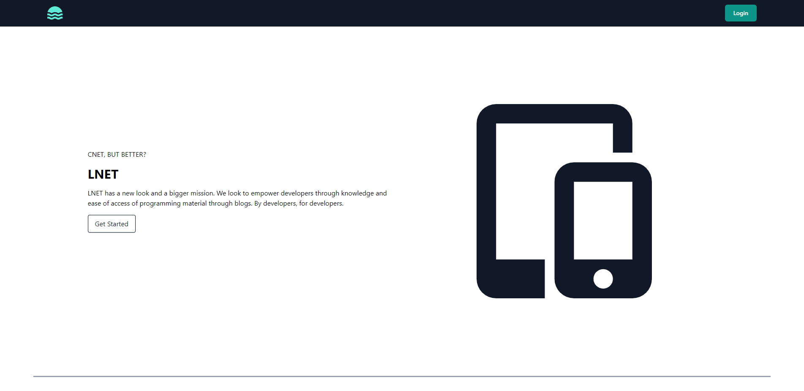

# Tech Blog - LNET
Got something to say? Blog about it using LNET.

## Table of Contents
- [Introduction](#introduction)
- [Application Preview](#application-preview)
- [Tech Stack](#tech-stack)
- [Installation](#installation)
- [Project Notes](#project-notes)

## Introduction
A CMS-style blog web app using Sequelize, Express, Handlebars, and Tailwind. User authentication is handled through express middleware and Bcrypt, with some business logic authentication as well as frontend error handling. Database language used is Mysql2 for Sequelize and its respective models can be found in /models.

## Application Preview
App is deployed in [Heroku.](https://lnet.herokuapp.com/)

## Tech Stack
Technologies used includes:
1. Nodejs
2. Sequelize (Mysql2)
3. Express
4. Handlebars
5. Tailwind
6. Bcrypt
7. Heroku

## Installation

## Project Notes

